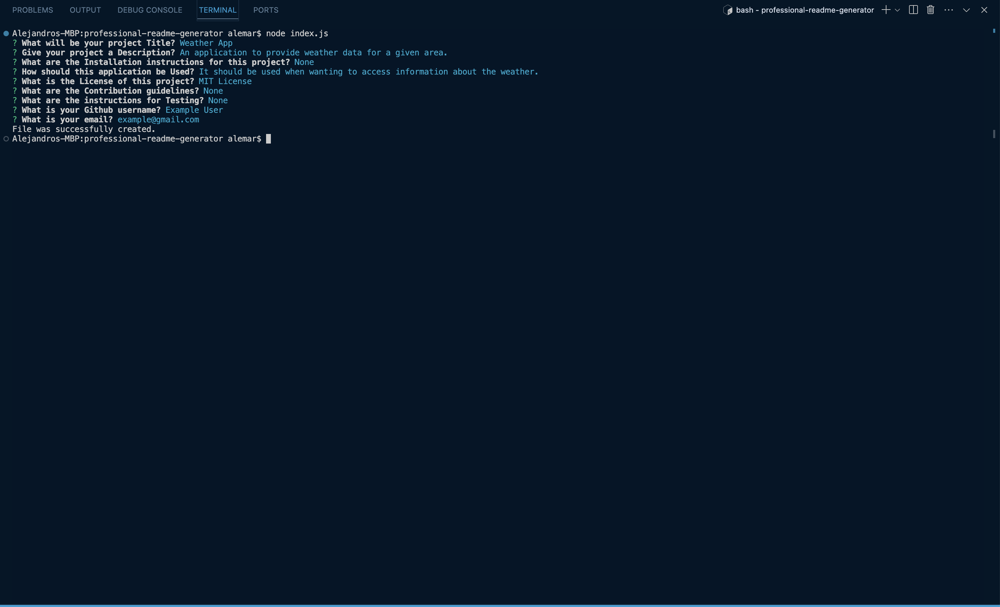
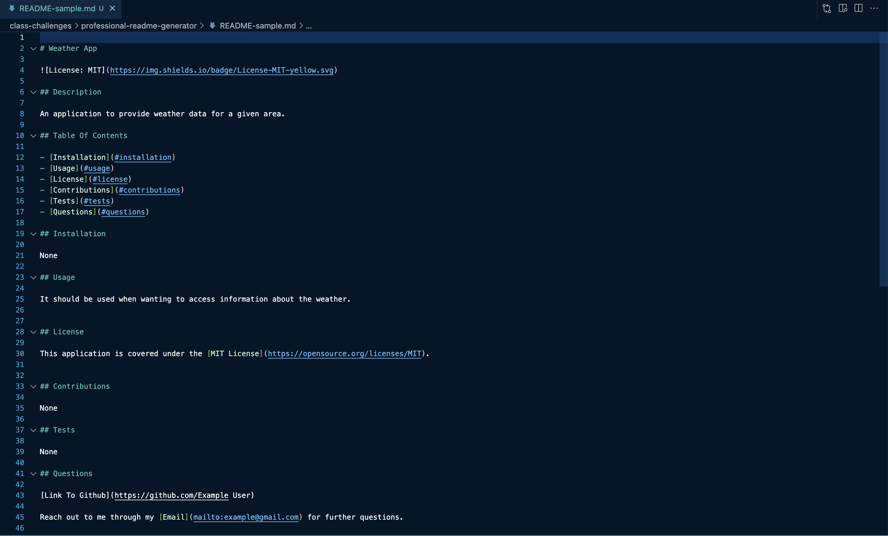
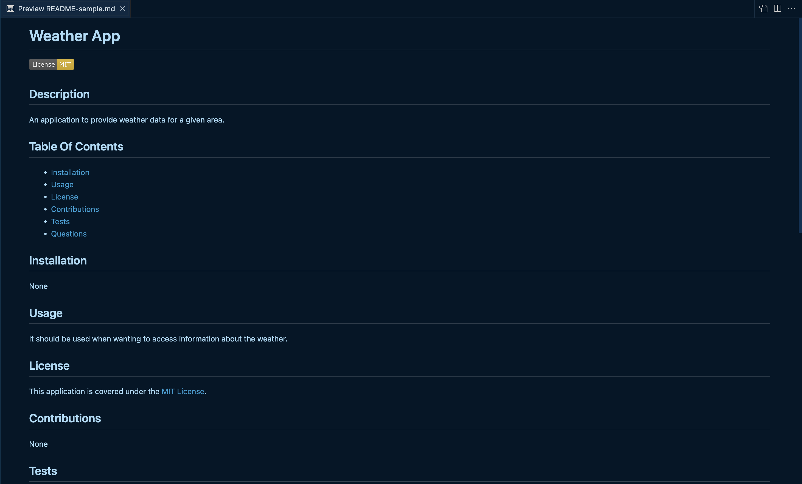

# Professional README Generator

## Description

This is a command line application that will generate a professional
README.md file based on user input. It uses the inquirer package to 
accept user input.

## Built With

- NodeJS
- Inquirer Package
- File System Module

## Screenshots

